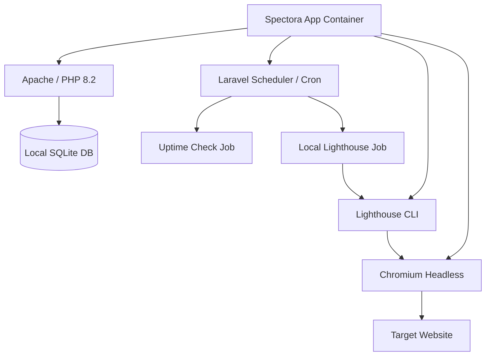

# 🛡️ Spectora: Google-Free Agency Edition

[](https://laravel.com)
[](https://www.docker.com)
[](https://gdpr-info.eu/)
[](https://github.com/everlite/Spectora)

**Spectora Agency Edition** ist ein hochspezialisiertes, selbstgehostetes Monitoring-Tool für Agenturen. Es wurde entwickelt, um ein zentrales Dashboard für alle Kunden-Domains zu bieten – ohne Abhängigkeit von Drittanbietern und mit maximalem Datenschutz.

---

## 🚀 Die "Google-Free" Philosophie

Im Gegensatz zu herkömmlichen Monitoring-Tools operiert Spectora vollständig autark. Alle Analysen finden **lokal in deinem Container** statt.

*   **Kein Google PageSpeed API-Key**: Analysen werden via lokalem Lighthouse CLI und Chromium durchgeführt.
*   **Keine Google Fonts**: Wir nutzen einen modernen **System Font Stack**. Keine externen Anfragen, keine Tracking-Cookies, maximale Ladegeschwindigkeit.
*   **Keine CDNs**: Alle Skripte (u.a. Alpine.js) sind lokal gebündelt.
*   **Privater Search-Engine-Crawler**: Unser Watchdog identifiziert sich als `SpectoraBot`, um Sicherheitschecks ohne Masquerading durchzuführen.

---

## 📊 Kernfunktionen

### 1. Uptime & Performance Monitoring
Echtzeit-Überwachung der Erreichbarkeit und Latenz deiner Domains.
*   **Intervall**: Alle 15 Minuten (konfigurierbar).
*   **Lighthouse Audits**: Vollständige Performance-Scores (Desktop/Mobile) direkt aus deinem Container.

### 2. Security Watchdog
Ein intelligenter Scanner, der Webseiten auf typische Bedrohungen prüft:
*   **Malware-Keywords**: Scan auf Pharma-Spam, Gambling-Content und kriminelle Keywords.
*   **SEO-Check**: Prüfung auf `display:none` Manipulationen und versteckte Links.
*   **Verification-Checks**: Validierung von Search Console Meta-Tags.

### 3. SSL & Domain Health
*   **SSL-Status**: Anzeige der verbleibenden Gültigkeitstage deiner Zertifikate.
*   **Zustandsbericht**: Farblich kodiertes Dashboard für sofortigen Überblick über kritische Probleme.

### 4. Agency Reporting
Generiere professionelle Berichte für deine Kunden direkt im Dashboard.

---

## 🛠️ Technische Architektur

Spectora nutzt ein modernes, dockerisiertes Setup, das alle notwendigen Abhängigkeiten für lokale Audits mitbringt.



---

## 📥 Installation

### Voraussetzungen
*   **Docker & Docker Compose**
*   **Hardware**: Mindestens **2 GB RAM** (für Chromium/Lighthouse-Prozesse)

### 1. Setup
```bash
# Repository klonen
git clone https://github.com/everlite/Spectora.git
cd Spectora

# Konfiguration vorbereiten
cp .env.example .env
```

### 2. Start
```bash
docker-compose up -d --build
```

### 3. Initialisierung
```bash
docker-compose exec app php artisan key:generate
docker-compose exec app php artisan migrate --force
```

Die Anwendung ist nun unter **http://localhost:8000** erreichbar.

---

## ⚙️ Konfiguration (.env)

Da Spectora keine externen APIs nutzt, ist die Konfiguration minimal:

*   `DB_CONNECTION=sqlite`: Standardmäßig vorkonfiguriert.
*   `MAIL_*`: Konfiguration für den Versand von Berichten.
*   **Kein API-Key für PageSpeed erforderlich!**

---

## 🛡️ Datenschutz & DSGVO

Spectora ist die ideale Wahl für europäische Agenturen:
1.  **Datenhoheit**: Alle Analysedaten verbleiben in deiner eigenen Infrastruktur.
2.  **Zero-Tracking**: Keine Einbindung von Google Analytics, Fonts oder Maps im Dashboard.
3.  **Client-Sicherheit**: Deine Kundendaten werden nie an Google-Server zur Analyse übertragen.

---

## 📝 Lizenz & Credits

Entwickelt für Agenturen, die Wert auf Privatsphäre und Unabhängigkeit legen. 
*   **Framework**: [Laravel 11](https://laravel.com)
*   **Frontend**: [Alpine.js](https://alpinejs.dev) & Tailwind CSS
*   **Monitoring**: [Google Lighthouse](https://developers.google.com/web/tools/lighthouse) (Local Version)

---
*Created by Modern Agency Tools & Privacy Enthusiasts.*
